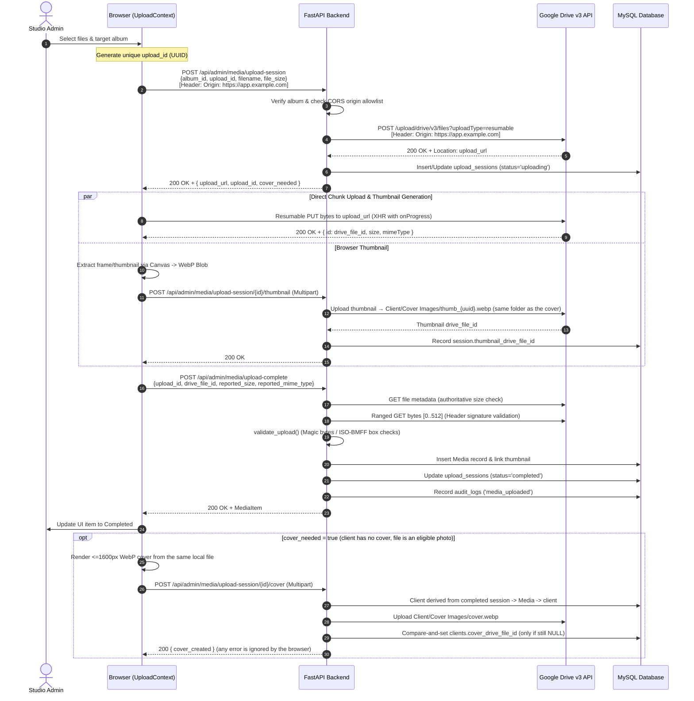

# Architecture: Media Storage & Upload Pipeline

This document details the architecture, design decisions, end-to-end data flow, and error-handling mechanisms for media uploads and storage in **LoveStory PH**.

---

## 1. Executive Summary

Media files (high-resolution wedding photos and large video files up to 10 GB) are stored in **Google Drive**, organized by client and album subfolders. 

To prevent bandwidth saturation, server memory exhaustion, and long-running HTTP request timeouts on the application server, the platform implements a **Direct-to-Drive Resumable Upload Architecture**:

- **Zero VPS Relay**: The browser transfers raw file bytes directly to Google Drive via resumable upload URLs. No multi-GB payload ever passes through the backend server's disk or network interface.
- **Backend Session Coordination**: The backend authenticates requests, provisions the resumable session with Google Drive (injecting proper CORS origins), maintains an idempotency ledger in MySQL (`upload_sessions`), validates file metadata, and completes DB persistence.
- **Client-Side Thumbnail Extraction**: Poster frames for videos and downscaled thumbnails for photos are generated in the browser using HTML5 Canvas and WebP compression, eliminating server-side FFmpeg processing and avoiding costly re-downloads of video files.
- **Global Upload Persistence**: Upload state is managed via React Context (`UploadContext`), allowing admins to navigate freely between admin pages while transfers continue seamlessly in the background, monitored by a global floating status badge.

---

## 2. System Components

### 2.1 Backend Services & Handlers

| Component | File Path | Responsibilities |
|---|---|---|
| **Admin Media Routes** | `backend/app/api/admin_media.py` | API endpoints for session creation, progress reporting, thumbnail attachment, completion confirmation, and abandonment. |
| **Media Service** | `backend/app/services/media_service.py` | Business logic for validating upload intent, initiating Drive resumable sessions, validating file headers via ranged reads, managing session state transitions, and creating `Media` records. |
| **Google Drive Service** | `backend/app/services/google_drive_service.py` | Encapsulates Google Drive API v3 interactions (resumable session initialization, ranged chunk downloads, folder management, file deletion). Holds OAuth2 credentials server-side; frontend never sees Drive credentials. Every network call uses a dedicated per-call httplib2 client (httplib2 is not thread-safe), so concurrent upload confirmations can never share a socket across threads. |
| **Thumbnail Worker** | `backend/app/workers/thumbnail_worker.py` | Normalizes browser-submitted WebP thumbnails; provides optional fallback image downscaling and server-side FFmpeg poster extraction for backfill scripts. |
| **Upload Session Model** | `backend/app/models/upload_session.py` | MySQL `upload_sessions` table acting as an idempotency ledger with fields: `admin_id`, `upload_id`, `album_id`, `filename`, `total_bytes`, `bytes_uploaded`, `status`, `drive_file_id`, `thumbnail_drive_file_id`. |
| **Circuit Breaker & Retry** | `backend/app/services/circuit_breaker.py` `backend/app/services/retry.py` | Fast-failing protection against Google API outages and exponential backoff for transient network issues. |

### 2.2 Frontend Components & Utilities

| Component | File Path | Responsibilities |
|---|---|---|
| **Upload Context** | `frontend/src/contexts/Uploadcontext.tsx` | Global React context holding upload queue state, scheduling concurrent uploads (max 4), tracking progress, retrying, and managing `File` memory cleanup. |
| **Uploads Page** | `frontend/src/pages/Uploads.tsx` | UI interface for drag-and-drop file selection, album targeting, upload progress bars, error notifications, and batch actions. |
| **Global Upload Badge** | `frontend/src/components/Globaluploadbadge.tsx` | Floating UI badge rendered across all admin routes when uploads are active in the background. |
| **Video Poster Utility** | `frontend/src/utils/videoPoster.ts` | Uses `<video>` and `<canvas>` to capture a frame at $t \approx 1.0\text{s}$ into an uploaded video, exporting as WebP. |
| **Photo Thumbnail Utility** | `frontend/src/utils/photoThumbnail.ts` | Uses `Image` and `<canvas>` to downscale photos to $\le 400\text{px}$ WebP thumbnails, and (through the same renderer) the automatic client cover at $\le 1600\text{px}$. |
| **Cover Service** | `backend/app/services/cover_service.py` | Decides cover eligibility, stores the client's single automatic cover under its `Cover Images` Drive folder (shared with video posters / photo thumbnails) with atomic compare-and-set, and attaches it from a completed upload session (§4.7). |
| **Admin API Service** | `frontend/src/services/admin.ts` | Handles XHR PUT requests to Google Drive resumable URLs, reporting upload progress, and calling backend session endpoints. |

---

## 3. End-to-End Upload Sequence

---

## 4. Key Architectural Mechanisms

### 4.1 CORS Origin Forwarding on Resumable Sessions

When initiating a resumable upload directly from a web browser to Google Drive (`googleapis.com`), the browser enforces Cross-Origin Resource Sharing (CORS). 

Google Drive's resumable upload endpoint **requires** that the initial `POST` request opening the session includes the client's `Origin` header. If the initiating server does not forward this `Origin` header, Google Drive will not attach `Access-Control-Allow-Origin` response headers to subsequent `PUT` requests from the browser, resulting in client-side CORS errors.

**Implementation**:
1. In `admin_media.py`, the backend inspects `request.headers.get("origin")`.
2. It verifies that the origin exists in `settings.effective_cors_origins` (derived from `CORS_ORIGINS` and local defaults). If valid, it forwards `Origin: <origin>` to Drive during `create_resumable_session()`.
3. Google Drive binds this origin to the generated `upload_url`. Subsequent browser `PUT` requests succeed with standard CORS preflights.

### 4.2 Client-Side Thumbnail Generation

Generating video poster frames on a VPS server typically requires downloading multi-gigabyte video files back from Google Drive into server memory/disk and running FFmpeg. 

To eliminate this bottleneck:
1. **Video Poster Extraction (`videoPoster.ts`)**: When a video is queued, a hidden 1×1px `<video>` element is **attached to the document** (off-screen, `opacity: 0.01`) with `URL.createObjectURL(file)`. The element must be in the DOM — browsers only *paint* frames for rendered media, so a detached element draws black. With `preload="auto"` it seeks to a position, then plays muted while waiting for `requestVideoFrameCallback` (a frame the decoder actually delivered), pauses, and draws to an HTML5 `<canvas>` as `image/webp` (quality 0.82, max dimension 720px). It samples 25%, 50% and 75% of the clip and keeps the brightest frame; a never-decoded, solid-black frame (luma ≤ 4) is never stored — the utility returns `null` instead.
2. **Photo Thumbnail Downscaling (`photoThumbnail.ts`)**: For high-resolution photos, an `Image` object renders to canvas and scales down to $\le 400\text{px}$ WebP.
3. **Upload via Session Hook**: The browser uploads the lightweight WebP blob (~10–100 KB) to `POST /api/admin/media/upload-session/{upload_id}/thumbnail`.
4. **Where they are stored**: both the video poster and the photo thumbnail are written to the client's single **`Cover Images`** Drive folder — the same folder that holds `cover.webp` — never inside an album folder. A shared `Cover Images` folder is created/claimed once per client (`ensure_cover_folder`), so every client has exactly one imagery folder.
5. **Best-Effort Resiliency**: Thumbnail generation has a 20-second timeout. If the browser or client codec fails to extract a frame (or only produces black), nothing is stored and the main upload continues unimpeded. The gallery grid gracefully falls back to a placeholder icon.

### 4.3 Idempotency Ledger & Upload Session Lifecycle

The `upload_sessions` table ensures crash recovery, deduplication, and retry granularity:

- **Idempotency Key (`upload_id`)**: A unique UUID generated by the frontend. Crucially, the filename is omitted from the ID string, preventing `VARCHAR(100)` DB column overflow on long filenames.
- **Session States**:
  - `queued`: Session reserved, awaiting client transfer.
  - `uploading`: Resumable URL issued; client transfer in flight.
  - `completed`: Drive upload confirmed and `Media` record created.
  - `failed`: Terminal failure with `error_code` and `error_message`.
  - `cancelled`: Explicitly cancelled by user via `abandon_direct_upload()`.
- **Replay Safety**: If a client re-submits an `upload_id` that is already `completed`, the server immediately returns the existing `Media` record without initiating a duplicate upload.
- **Two-Phase Commit Guarantee**: During `complete_direct_upload`, the backend records `session.drive_file_id` immediately before performing header validation. If validation fails or a crash occurs, the file ID is recorded, allowing orphan cleanup jobs to reclaim storage.

### 4.4 Ranged Read Header Validation

The server never trusts client-reported MIME types or file contents. However, downloading entire multi-gigabyte files to verify magic bytes would undermine the direct upload design.

Instead, during `complete_direct_upload`:
1. The backend issues an HTTP Range request to Google Drive (`storage.download(drive_file_id, range_start=0, range_end=511)`).
2. `validate_upload()` verifies:
   - Image magic signatures (JPEG SOI, PNG header, WebP RIFF).
   - Video container validation: Walks ISO-BMFF boxes (`ftyp`, `moov`, `mdat`) for MP4 and QuickTime MOV containers.
3. If signatures do not match the declared extension, the Drive file is deleted immediately and an error is returned.

### 4.5 Concurrency & Memory Management

- **Queue Throttling**: The frontend scheduler restricts active concurrent uploads to `MAX_CONCURRENT_UPLOADS = 4` to prevent saturating client uplink bandwidth and browser connection pools.
- **DOM/Memory Release**: Once a file finishes uploading or is cancelled, `withReleasedFile()` nullifies the `File` reference in the React state. This prevents hundreds of megabytes of binary buffers from being pinned in browser heap memory during large batches.
- **Global Upload Context**: Managed by `UploadContext.tsx`. State is mounted at the root admin provider level, ensuring route transitions do not interrupt ongoing XHR requests.
- **Global Status Badge**: `GlobalUploadBadge.tsx` displays active upload counts, progress percentage, and spinning indicators across all admin screens.

### 4.6 Concurrent Confirmation, Drive Client Isolation & Retry Recovery

Multiple files finishing around the same time run up to `MAX_CONCURRENT_UPLOADS`
confirmation requests (`POST /upload-complete`) concurrently. Each one re-confirms
the just-uploaded file with Google Drive (`get_file` + a ranged header read-back)
before creating the `Media` row. Two failure modes specific to concurrency are
handled here:

- **Per-call Drive client isolation**: httplib2's `Http` object is **not
  thread-safe** — it keeps one connection cache per instance, so when two
  threads borrow the same socket at once their TLS streams cross, surfacing as
  random `[SSL: WRONG_VERSION_NUMBER]` errors or whole-request hangs. `upload()`,
  `download()`, `create_resumable_session()`, `get_file()` and `delete()` each
  build their own `httplib2.Http` + `AuthorizedHttp` per call, route the
  request's `execute()` through it, and close it afterwards. Building the
  request object off the shared discovery client stays safe (pure client-side);
  only the network call is isolated.
- **Post-PUT propagation tolerance**: immediately after a browser's direct PUT
  finishes, Drive can take a moment to finalize the new file. The confirmation's
  metadata lookup retries a `404`/not-visible response a few times with a short
  delay (`UPLOAD_CONFIRM_404_RETRIES` in `media_service.py`) before the session
  is condemned as `failed`.
- **Retry never dead-ends**: if a previous confirmation attempt still burned the
  session to `failed`, calling `/upload-complete` against it would otherwise
  409 forever ("This upload session is 'failed', not awaiting completion.").
  `retryCompleteOnly` detects that `UPLOAD_NOT_IN_PROGRESS` response and falls
  back to `startUpload`, which re-opens the failed session under the *same*
  `upload_id` for a fresh upload — a burned batch stays recoverable instead of
  being permanently stuck.

### 4.7 Automatic Client Cover

Every client gets one cover for the gallery landing page, with no admin action and no way to change it. It rides on the pipeline above without changing it: the original still goes browser → Drive directly, nothing is stored on the VPS, and the original is never downloaded or copied.

1. **Is one needed?** `POST /upload-session` returns `cover_needed = client has no cover AND the file is a still photo (jpg/jpeg/png/webp; not video, not GIF)`. When false the browser does no extra work at all.
2. **Build it in the browser.** In parallel with the thumbnail, `extractPhotoCover` renders the *same* local file to a $\le 1600\text{px}$ WebP (high-quality resampling) - big enough for a hero, nowhere near original resolution.
3. **Send it after completion.** Only once `POST /upload-complete` has succeeded and the item shows Completed, the browser fires `POST /upload-session/{id}/cover` and does not wait for it. Consequences: the cover always derives from a stored, validated, committed photo; it cannot hold an upload slot; and a cover failure **cannot** fail or roll back the upload - the Media row is already committed.
4. **Server side.** The client is derived from the admin's own *completed* session → its Media → that Media's client (nothing about client/album/media comes from the request). The blob is re-encoded (`normalize_browser_cover`: WebP, $\le 1600\text{px}$, metadata stripped), a `Cover Images` folder is created under the **client** folder if needed (never inside an album), and `cover.webp` is stored there without an `upload_id` (so orphan reconciliation cannot mistake it for an abandoned upload). This folder is shared — video posters and photo thumbnails are stored in the same `Cover Images` folder, so a client has exactly one imagery folder.
5. **Exactly one, first wins.** Both the folder id (`clients.cover_folder_id`) and the file id (`clients.cover_drive_file_id`) are claimed with `UPDATE ... WHERE col IS NULL`. If several uploads of a new client finish together, one wins and the others delete their own stray file and report `cover_created: false`. Once set the cover is never replaced.
6. **Failure and recovery.** Errors are logged (`cover.failed`) and the client simply still has no cover; the next eligible upload is told `cover_needed` again and retries, reusing the recorded folder. A `Cover Images` folder deleted by hand is forgotten and recreated. Clients that predate covers (`NULL`) heal the same way; the landing page shows its default backdrop until then.

| Column / route | Purpose |
|---|---|
| `clients.cover_drive_file_id` | Drive id of `cover.webp` (nullable, never returned by any API) |
| `clients.cover_folder_id` | Drive id of the client's `Cover Images` folder (nullable; also holds the video posters / photo thumbnails) |
| `POST /api/admin/media/upload-session/{id}/cover` | Admin-only; 409 `UPLOAD_NOT_COMPLETED` before completion, 409 `COVER_SOURCE_NOT_ELIGIBLE` for a video, 400 `COVER_INVALID`, 502 `COVER_STORAGE_FAILED`; otherwise `{cover_created}` |
| `GET /api/client/gallery/cover` | The signed-in client's own cover; `no-cache` + `ETag` (the URL is the same for every client) |

---

## 5. Failure Recovery & Edge Cases

| Scenario | Handled By | System Behavior |
|---|---|---|
| **User navigates away from `/admin/uploads`** | `UploadContext` | Upload continues in background; `GlobalUploadBadge` displays live progress. |
| **User cancels upload** | `abandonUploadSession` | In-flight XHR is aborted; backend marks session `cancelled` to free the ledger slot. |
| **Drive upload succeeds, but confirm fails** | `retryCompleteOnly` + recovery | Frontend retains `driveFileId` and first retries only the confirmation step (no byte re-transfer). If that fails with `UPLOAD_NOT_IN_PROGRESS` (a prior attempt burned the session to `failed`), it falls back to re-opening a fresh session under the same `upload_id` and re-uploading instead of dead-ending on "This upload session is 'failed'...". |
| **Browser tab closed mid-upload** | Session recovery | On reload, incomplete sessions are retrieved via `GET /upload-sessions` and surfaced as failed (since browser `File` object cannot be restored). |
| **Server restart while uploads in-flight** | Lifespan Startup Sweep | `app/main.py` scans for lingering `uploading`/`queued` sessions and marks them `failed` (`UPLOAD_STALE`). |
| **Drive outage / 5xx errors** | `CircuitBreaker` | Trips after 3 consecutive network failures with a 20-second cooldown, preventing thread exhaustion. |
| **Cover generation or upload fails** | `attach_cover_from_upload` (best-effort) | Upload already completed and unaffected. Logged; the client keeps its default hero and the next eligible upload retries (§4.7). |
| **Orphaned files in Drive** | `reconcile_orphans.py` | Nightly cron identifies files in Drive without matching DB records (past grace period) and purges them. |