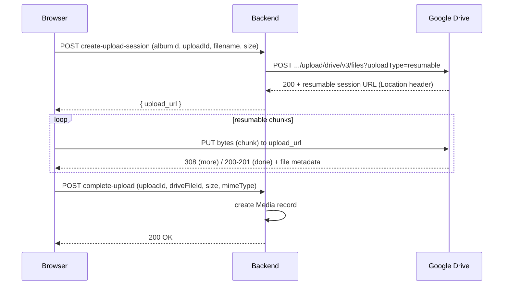

# Architecture: Media Storage & Upload Pipeline

_Last updated: reflects `GoogleDriveStorage` (backend) and `Uploads.tsx` (admin frontend) as reviewed._

## 1. Overview

The application stores client photos/videos in Google Drive. There are **two distinct upload
architectures present in the codebase today**, and they do not currently agree with each other.
This is flagged explicitly in §5 (Known Gap) because it's the direct cause of the CORS failure
under investigation.

| | Legacy / relay upload | Current frontend expectation |
|---|---|---|
| Where bytes travel | Browser → **backend** → Drive | Browser → **Drive directly** |
| Implemented in | `GoogleDriveStorage.upload()` | `Uploads.tsx` (`runDirectUpload`) |
| Backend touches file bytes? | Yes, streamed via `MediaIoBaseUpload` | No — only creates/confirms the session |
| CORS exposure | None (server-to-server) | Yes — browser talks to `googleapis.com` |

The frontend has been rebuilt around the second model (direct-to-Drive resumable upload), but the
one backend module reviewed so far (`GoogleDriveStorage`) still only implements the first model.
The endpoint the frontend actually calls to obtain a resumable `upload_url`
(`adminService.createUploadSession`) has **not yet been reviewed** — see §5.

## 2. Components

### 2.1 `GoogleDriveStorage` (backend, Python)
- The **only** module permitted to import `googleapiclient` / `google.auth`. All other backend
  code talks to Drive through `StorageService`'s abstract interface.
- Holds a single OAuth2 refresh-token-based `Credentials` object; instantiated server-side only.
  Frontend code never sees Drive credentials.
- Responsibilities:
  - Folder CRUD (`create_folder`, `rename_folder`, `delete_folder`)
  - File CRUD (`upload`, `download`, `delete`, `get_file`, `move_file`)
  - Storage quota reporting (`get_metadata`)
- **Upload path (`upload()`)** currently implements a full **relay**: the backend receives the
  file (already spooled server-side), wraps it in `MediaIoBaseUpload` with a bounded chunk size,
  and performs the resumable upload to Drive itself, chunk by chunk, inside `next_chunk()` calls.
  This means, as written, the backend is the party talking to `googleapis.com`, not the browser.
- **Download path (`download()`)** streams file bytes back out as a generator, supporting HTTP
  Range requests so video can be scrubbed without buffering the whole file server-side.
- **Hardening built into this module:**
  - Per-call dedicated `httplib2.Http` clients (not the shared service client) for both upload and
    download, to avoid connection-cache crosstalk between concurrent transfers.
  - Explicit socket timeouts everywhere (httplib2 has no default timeout).
  - A circuit breaker (`get_drive_circuit_breaker`) short-circuits calls during a systemic outage
    instead of letting every concurrent request pay full retry+backoff cost.
  - Central retry classification (`_is_retryable_google_error`) covering `HttpError` (5xx/429),
    `TimeoutError`/`ConnectionError`, `httplib2.HttpLib2Error`, transient `OSError`
    (SSL/proxy-inspection failures), the known httplib2/CPython double-close bug on
    `IncompleteRead`, and generic `http.client.HTTPException` (`IncompleteRead`, `BadStatusLine`).
  - `redirect_codes` on the upload's raw `httplib2.Http` explicitly excludes `308`, since Drive's
    resumable protocol uses HTTP 308 to mean "send next chunk," not "redirect" — httplib2's
    default would otherwise raise `RedirectMissingLocation` on every multi-chunk upload.
  - `delete()` trashes rather than permanently deletes, because the service account is typically
    an Editor (not owner) on a human-owned Drive folder and lacks permanent-delete rights.
  - Files are tagged with `appProperties` (`gallery_managed`, `gallery_upload_id`) to support
    orphan reconciliation independent of filename matching.

### 2.2 `Uploads.tsx` (admin frontend, React)
Implements a **direct-to-Drive resumable upload** flow with a queue/scheduler UI:

1. **Reserve a session** — `adminService.createUploadSession(albumId, uploadId, filename, size)`
   asks the backend to open a Google Drive resumable-upload session and returns an `upload_url`.
   The backend is expected to do this itself (server-to-server call to Drive) and hand back the
   session URL; **the file's bytes are not sent to the backend at all.**
2. **Upload bytes directly to Drive** — `adminService.uploadToDrive(uploadUrl, file, onProgress)`
   performs the resumable `PUT` sequence straight from the browser to `googleapis.com`.
3. **Confirm with the backend** — once Drive returns a file id/size/mimeType,
   `adminService.completeUpload(uploadId, driveFileId, size, mimeType)` tells the backend to
   create the corresponding `Media` DB record.

Supporting behavior:
- **Idempotent `upload_id`**: a UUID (or timestamp/random fallback) generated client-side once per
  file and reused verbatim across retries of that same file, so the backend can distinguish a
  genuine retry from a duplicate upload. Deliberately does *not* embed the filename, since
  `upload_session.upload_id` is a bounded `VARCHAR(100)` column and long filenames previously
  caused raw 500s.
- **Bounded concurrency** (`MAX_CONCURRENT_UPLOADS = 4`): a scheduler effect tops up active
  uploads rather than firing an entire batch at once; "active" includes `finalizing`, since the
  browser's request to the backend stays open through that phase too.
- **Session recovery on refresh**: `listUploadSessions()` restores sessions the backend still
  considers `queued`/`uploading`, but since the browser now owns the transfer, a restored session
  can never actually resume — the `File` object is gone once the tab closes. These are surfaced as
  failed, prompting the user to re-select and re-upload.
- **Retry granularity**: if the Drive PUT already succeeded but `completeUpload` failed, the item
  caches `driveFileId`/`reportedSize`/`reportedMimeType` and retry re-runs only the confirmation
  call — never re-uploads the file.
- **Cancellation**: aborts the in-flight XHR when possible; for items that already reached
  `finalizing`, cancel is disabled since all bytes are already sent. Cancellation also calls
  `abandonUploadSession()` so the backend doesn't hold the session open as "uploading" until its
  own staleness sweep times it out.
- **Best-effort progress reporting**: `reportUploadProgress()` is throttled to ~1/second purely so
  *other* views (a second tab, a refreshed page) can see rough progress; failures here are
  swallowed and never block or fail the upload itself.

## 3. End-to-end flow (current frontend expectation)

## 4. Error handling & resiliency summary

| Failure | Where handled | Behavior |
|---|---|---|
| Drive 404 | `_translate_http_error` | → `StorageNotFoundError` |
| Drive 403/429 | `_translate_http_error` | → `StorageQuotaExceededError` |
| Transient network/SSL/proxy errors | `_is_retryable_google_error` + `_retry` | Retried with backoff; resumable protocol continues from last confirmed byte |
| Refresh token revoked | `RefreshError` catch blocks | → `StorageError` ("authentication failed") |
| Systemic outage | Circuit breaker | Fails fast without per-request retry cost |
| Chunk/session exceeds timeout | `run_with_timeout` / session timer in `upload()` | → `StorageTimeoutError` |
| Browser's direct PUT fails | `runDirectUpload` catch | Marks item `error`, calls `abandonUploadSession` so retry isn't rejected as a duplicate |
| `completeUpload` fails after successful Drive PUT | `retryCompleteOnly` | Retries only the confirmation call, not the upload |
| Page refreshed mid-upload | Session-recovery effect | Session shown as needing a fresh upload; no resume possible client-side |

## 5. Known gap — CORS on the resumable session (open item)

The reported CORS failure (`Access to XMLHttpRequest ... blocked by CORS policy`) occurs on the
browser's direct `PUT` to the Drive `upload_id` URL. This points to the **session-creation step**
on the backend (behind `adminService.createUploadSession`), which has not yet been shared/reviewed.

For Drive to allow a browser to PUT directly to a resumable session URL, the **initial POST that
creates that session** must include an `Origin` header matching the browser origin that will later
perform the PUT (e.g. `http://localhost:5173` in dev). If that initiating POST is made
server-side via `googleapiclient`/`httplib2` without an explicit `Origin` header — which is the
default — Drive will not enable CORS for the resulting session, and every subsequent browser PUT
to it fails exactly as observed.

**Next step:** locate and review the backend route/service behind `createUploadSession`
(likely named something like `create_upload_session`, in an `uploads` router or a dedicated
`upload_session_service.py`), and confirm/add the `Origin` header on its session-creation request
to Drive. This file should be added to this architecture doc once reviewed.

## 6. Open questions / follow-ups
- Reconcile `GoogleDriveStorage.upload()` (full relay) with the frontend's direct-to-Drive model —
  is the relay path dead code, used for a different call site (e.g. a non-browser integration), or
  mid-migration?
- Document the backend upload-session and complete-upload endpoints once reviewed.
- Document `adminService` (frontend) — `uploadToDrive`, `createUploadSession`, `completeUpload`,
  `abandonUploadSession`, `reportUploadProgress`, `listUploadSessions`.
- Document the `upload_session` DB table/model referenced by `upload_id` (VARCHAR(100)) and its
  status lifecycle (`queued` → `uploading` → `done`/`error`/`cancelled`), plus the staleness sweep
  that eventually times out abandoned sessions.