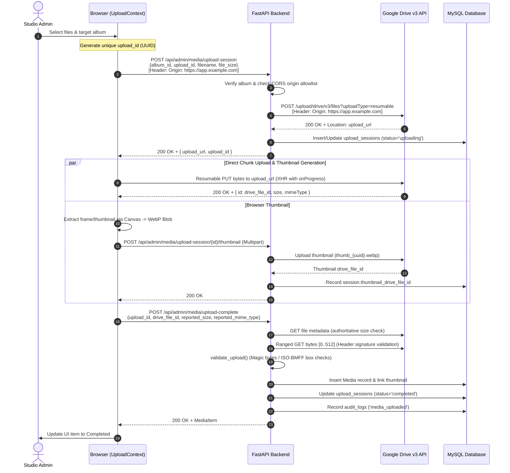

# Architecture: Media Storage & Upload Pipeline

This document details the architecture, design decisions, end-to-end data flow, and error-handling mechanisms for media uploads and storage in **LoveStory PH**.

---

## 1. Executive Summary

Media files (high-resolution wedding photos and large video files up to 10 GB) are stored in **Google Drive**, organized by client and album subfolders. 

To prevent bandwidth saturation, server memory exhaustion, and long-running HTTP request timeouts on the application server, the platform implements a **Direct-to-Drive Resumable Upload Architecture**:

- **Zero VPS Relay**: The browser transfers raw file bytes directly to Google Drive via resumable upload URLs. No multi-GB payload ever passes through the backend server's disk or network interface.
- **Backend Session Coordination**: The backend authenticates requests, provisions the resumable session with Google Drive (injecting proper CORS origins), maintains an idempotency ledger in MySQL (`upload_sessions`), validates file metadata, and completes DB persistence.
- **Client-Side Thumbnail Extraction**: Poster frames for videos and downscaled thumbnails for photos are generated in the browser using HTML5 Canvas and WebP compression, eliminating server-side FFmpeg processing and avoiding costly re-downloads of video files.
- **Global Upload Persistence**: Upload state is managed via React Context (`UploadContext`), allowing admins to navigate freely between admin pages while transfers continue seamlessly in the background, monitored by a global floating status badge.

---

## 2. System Components

### 2.1 Backend Services & Handlers

| Component | File Path | Responsibilities |
|---|---|---|
| **Admin Media Routes** | `backend/app/api/admin_media.py` | API endpoints for session creation, progress reporting, thumbnail attachment, completion confirmation, and abandonment. |
| **Media Service** | `backend/app/services/media_service.py` | Business logic for validating upload intent, initiating Drive resumable sessions, validating file headers via ranged reads, managing session state transitions, and creating `Media` records. |
| **Google Drive Service** | `backend/app/services/google_drive_service.py` | Encapsulates Google Drive API v3 interactions (resumable session initialization, ranged chunk downloads, folder management, file deletion). Holds OAuth2 credentials server-side; frontend never sees Drive credentials. |
| **Thumbnail Worker** | `backend/app/workers/thumbnail_worker.py` | Normalizes browser-submitted WebP thumbnails; provides optional fallback image downscaling and server-side FFmpeg poster extraction for backfill scripts. |
| **Upload Session Model** | `backend/app/models/upload_session.py` | MySQL `upload_sessions` table acting as an idempotency ledger with fields: `admin_id`, `upload_id`, `album_id`, `filename`, `total_bytes`, `bytes_uploaded`, `status`, `drive_file_id`, `thumbnail_drive_file_id`. |
| **Circuit Breaker & Retry** | `backend/app/services/circuit_breaker.py` `backend/app/services/retry.py` | Fast-failing protection against Google API outages and exponential backoff for transient network issues. |

### 2.2 Frontend Components & Utilities

| Component | File Path | Responsibilities |
|---|---|---|
| **Upload Context** | `frontend/src/contexts/Uploadcontext.tsx` | Global React context holding upload queue state, scheduling concurrent uploads (max 4), tracking progress, retrying, and managing `File` memory cleanup. |
| **Uploads Page** | `frontend/src/pages/Uploads.tsx` | UI interface for drag-and-drop file selection, album targeting, upload progress bars, error notifications, and batch actions. |
| **Global Upload Badge** | `frontend/src/components/Globaluploadbadge.tsx` | Floating UI badge rendered across all admin routes when uploads are active in the background. |
| **Video Poster Utility** | `frontend/src/utils/videoPoster.ts` | Uses `<video>` and `<canvas>` to capture a frame at $t \approx 1.0\text{s}$ into an uploaded video, exporting as WebP. |
| **Photo Thumbnail Utility** | `frontend/src/utils/photoThumbnail.ts` | Uses `Image` and `<canvas>` to downscale photos to $\le 400\text{px}$ WebP thumbnails. |
| **Admin API Service** | `frontend/src/services/admin.ts` | Handles XHR PUT requests to Google Drive resumable URLs, reporting upload progress, and calling backend session endpoints. |

---

## 3. End-to-End Upload Sequence

---

## 4. Key Architectural Mechanisms

### 4.1 CORS Origin Forwarding on Resumable Sessions

When initiating a resumable upload directly from a web browser to Google Drive (`googleapis.com`), the browser enforces Cross-Origin Resource Sharing (CORS). 

Google Drive's resumable upload endpoint **requires** that the initial `POST` request opening the session includes the client's `Origin` header. If the initiating server does not forward this `Origin` header, Google Drive will not attach `Access-Control-Allow-Origin` response headers to subsequent `PUT` requests from the browser, resulting in client-side CORS errors.

**Implementation**:
1. In `admin_media.py`, the backend inspects `request.headers.get("origin")`.
2. It verifies that the origin exists in `settings.effective_cors_origins` (derived from `CORS_ORIGINS` and local defaults). If valid, it forwards `Origin: <origin>` to Drive during `create_resumable_session()`.
3. Google Drive binds this origin to the generated `upload_url`. Subsequent browser `PUT` requests succeed with standard CORS preflights.

### 4.2 Client-Side Thumbnail Generation

Generating video poster frames on a VPS server typically requires downloading multi-gigabyte video files back from Google Drive into server memory/disk and running FFmpeg. 

To eliminate this bottleneck:
1. **Video Poster Extraction (`videoPoster.ts`)**: When a video is queued, an off-screen HTML5 `<video>` element loads the `File` object using `URL.createObjectURL(file)`. It seeks to $1.0\text{s}$ (or midpoint for very short clips), draws the video frame to an HTML5 `<canvas>`, and converts it to an `image/webp` Blob (quality 0.82, max dimension 720px).
2. **Photo Thumbnail Downscaling (`photoThumbnail.ts`)**: For high-resolution photos, an `Image` object renders to canvas and scales down to $\le 400\text{px}$ WebP.
3. **Upload via Session Hook**: The browser uploads the lightweight WebP blob (~10–100 KB) to `POST /api/admin/media/upload-session/{upload_id}/thumbnail`.
4. **Best-Effort Resiliency**: Thumbnail generation has a 20-second timeout. If the browser or client codec fails to extract a thumbnail, the main upload continues unimpeded. The gallery grid gracefully falls back to a placeholder icon.

### 4.3 Idempotency Ledger & Upload Session Lifecycle

The `upload_sessions` table ensures crash recovery, deduplication, and retry granularity:

- **Idempotency Key (`upload_id`)**: A unique UUID generated by the frontend. Crucially, the filename is omitted from the ID string, preventing `VARCHAR(100)` DB column overflow on long filenames.
- **Session States**:
  - `queued`: Session reserved, awaiting client transfer.
  - `uploading`: Resumable URL issued; client transfer in flight.
  - `completed`: Drive upload confirmed and `Media` record created.
  - `failed`: Terminal failure with `error_code` and `error_message`.
  - `cancelled`: Explicitly cancelled by user via `abandon_direct_upload()`.
- **Replay Safety**: If a client re-submits an `upload_id` that is already `completed`, the server immediately returns the existing `Media` record without initiating a duplicate upload.
- **Two-Phase Commit Guarantee**: During `complete_direct_upload`, the backend records `session.drive_file_id` immediately before performing header validation. If validation fails or a crash occurs, the file ID is recorded, allowing orphan cleanup jobs to reclaim storage.

### 4.4 Ranged Read Header Validation

The server never trusts client-reported MIME types or file contents. However, downloading entire multi-gigabyte files to verify magic bytes would undermine the direct upload design.

Instead, during `complete_direct_upload`:
1. The backend issues an HTTP Range request to Google Drive (`storage.download(drive_file_id, range_start=0, range_end=511)`).
2. `validate_upload()` verifies:
   - Image magic signatures (JPEG SOI, PNG header, WebP RIFF).
   - Video container validation: Walks ISO-BMFF boxes (`ftyp`, `moov`, `mdat`) for MP4 and QuickTime MOV containers.
3. If signatures do not match the declared extension, the Drive file is deleted immediately and an error is returned.

### 4.5 Concurrency & Memory Management

- **Queue Throttling**: The frontend scheduler restricts active concurrent uploads to `MAX_CONCURRENT_UPLOADS = 4` to prevent saturating client uplink bandwidth and browser connection pools.
- **DOM/Memory Release**: Once a file finishes uploading or is cancelled, `withReleasedFile()` nullifies the `File` reference in the React state. This prevents hundreds of megabytes of binary buffers from being pinned in browser heap memory during large batches.
- **Global Upload Context**: Managed by `UploadContext.tsx`. State is mounted at the root admin provider level, ensuring route transitions do not interrupt ongoing XHR requests.
- **Global Status Badge**: `GlobalUploadBadge.tsx` displays active upload counts, progress percentage, and spinning indicators across all admin screens.

---

## 5. Failure Recovery & Edge Cases

| Scenario | Handled By | System Behavior |
|---|---|---|
| **User navigates away from `/admin/uploads`** | `UploadContext` | Upload continues in background; `GlobalUploadBadge` displays live progress. |
| **User cancels upload** | `abandonUploadSession` | In-flight XHR is aborted; backend marks session `cancelled` to free the ledger slot. |
| **Drive upload succeeds, but confirm fails** | `retryCompleteOnly` | Frontend retains `driveFileId`. Retry skips byte transfer and re-runs only finalization. |
| **Browser tab closed mid-upload** | Session recovery | On reload, incomplete sessions are retrieved via `GET /upload-sessions` and surfaced as failed (since browser `File` object cannot be restored). |
| **Server restart while uploads in-flight** | Lifespan Startup Sweep | `app/main.py` scans for lingering `uploading`/`queued` sessions and marks them `failed` (`UPLOAD_STALE`). |
| **Drive outage / 5xx errors** | `CircuitBreaker` | Trips after 3 consecutive network failures with a 20-second cooldown, preventing thread exhaustion. |
| **Orphaned files in Drive** | `reconcile_orphans.py` | Nightly cron identifies files in Drive without matching DB records (past grace period) and purges them. |